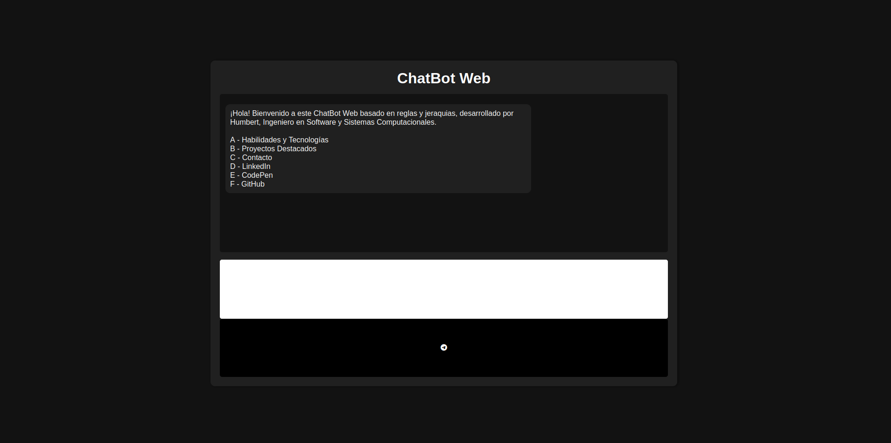
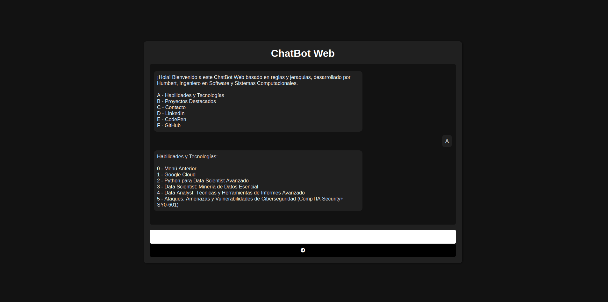
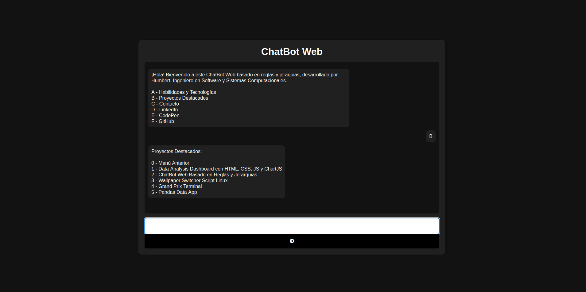

# 🤖 Chatbot Web Basado en Reglas

---

## ✨ Características
Este es un chatbot basado en reglas y jerarquías desarrollado para interactuar con los usuarios a través de una interfaz web. Utiliza un sistema de navegación de menús jerárquicos para responder preguntas y guiar a los usuarios a la información que necesitan.

- **Interfaz web interactiva** desarrollada con HTML, CSS y JavaScript.
- **Sistema de reglas predefinidas** para gestionar respuestas automáticas.
- **Navegación estructurada en menús** que permite explorar diferentes opciones paso a paso.
- **Fácil personalización** para agregar nuevas reglas y mejorar el flujo de conversación.

---

## 🧭 Uso
1. Abre el chatbot en tu navegador.
2. Sigue las instrucciones en pantalla y selecciona opciones para navegar entre los menús.
3. Recibe respuestas automáticas basadas en las reglas predefinidas.

---

## 🛠️ Personalización
- Se pueden agregar nuevas reglas y jerarquías gracias a su diseño modular.
- Es posible modificar el diseño y la interfaz con el archivo CSS.
- El chatbot puede utilizar una base de datos SQL.

---

## 🖼️ Imágenes

---

## 🌐 Demo en línea

https://codepen.io/Daniel-Humberto/pen/wBwVweQ

---

## 📝 Licencia
Este proyecto está licenciado bajo la [Licencia GNU](LICENSE).

---
